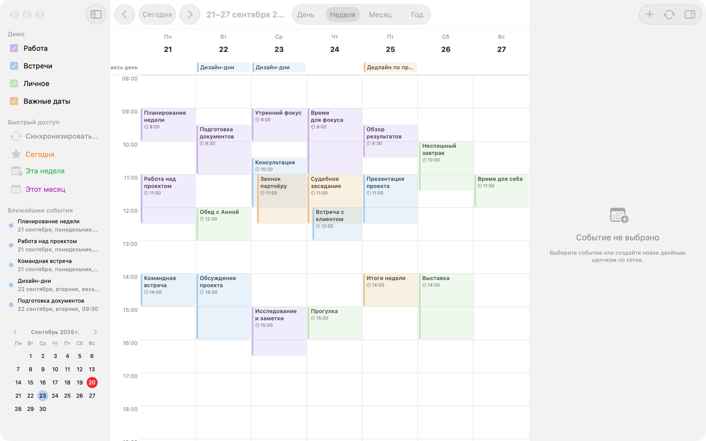
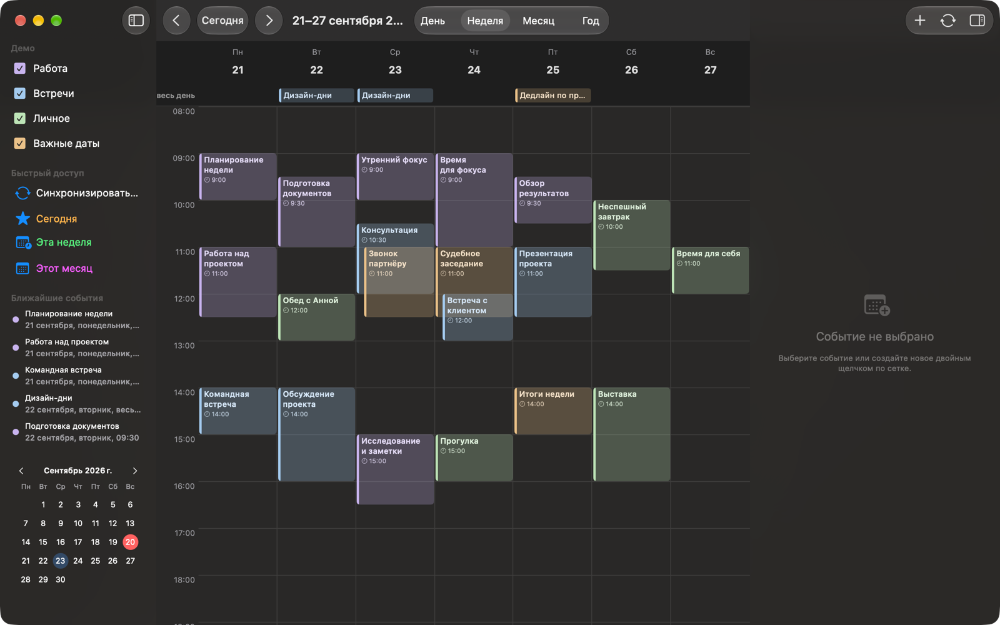
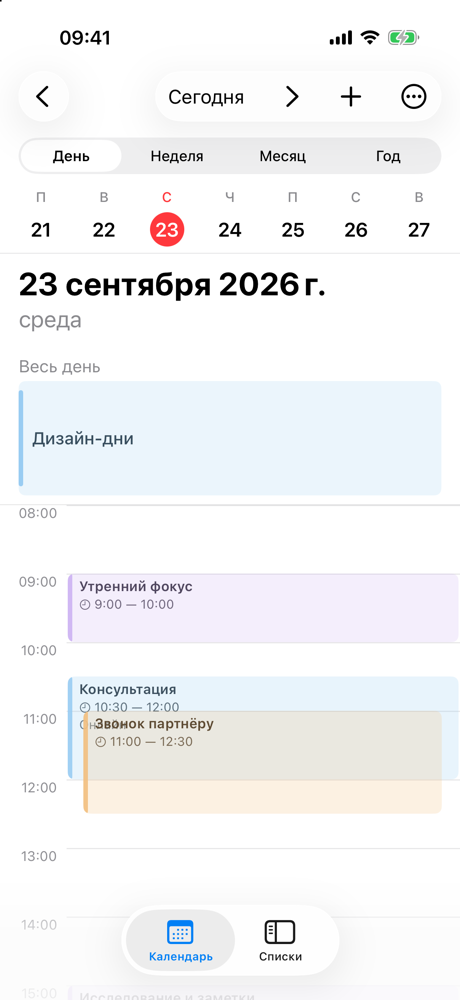
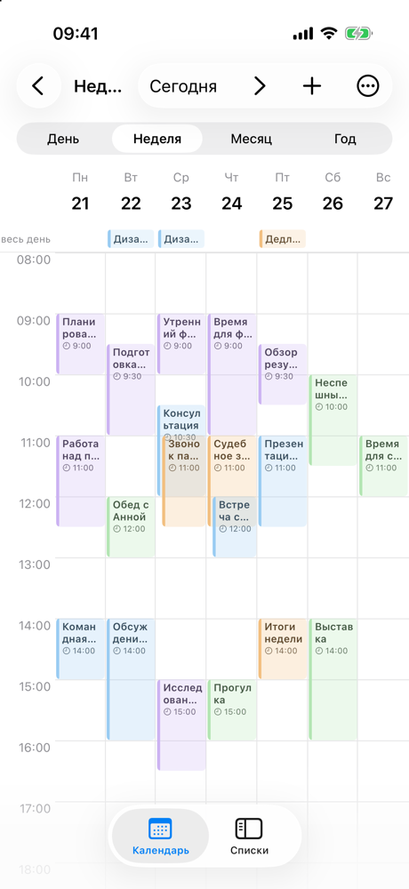
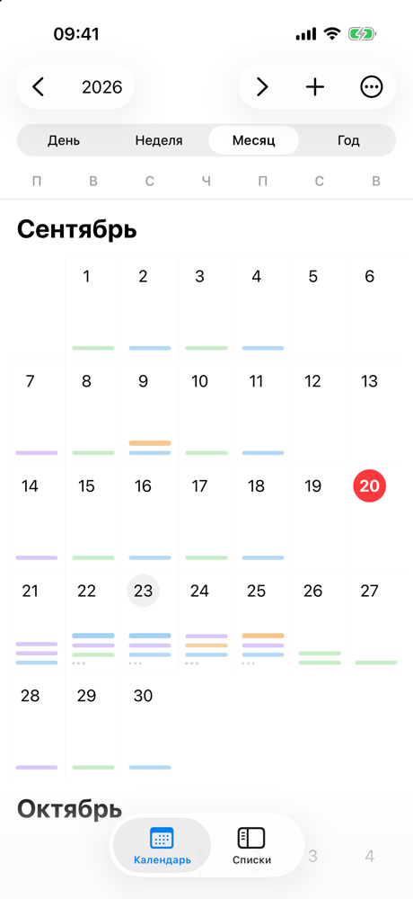
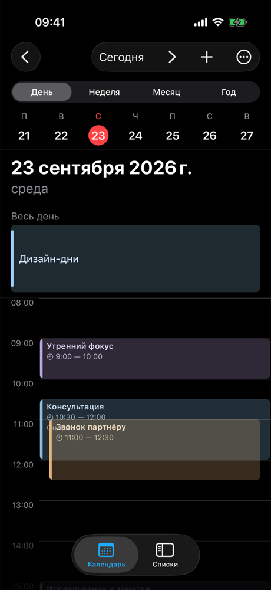

# LawMatic Calendar for macOS and iOS

Native LawMatic calendar for Mac, iPhone and iPad, built on [Kalends](https://github.com/lawlabs/kalends-swiftui).

Нативный календарь LawMatic на SwiftUI. Сетка дня, недели, месяца и года берётся из пакета Kalends. Само приложение владеет событиями, календарями, инспектором, синхронизацией и оболочкой.





<p align="center">
  
  
  
  
</p>

Пока пакет не опубликован, проект ссылается на соседний репозиторий как на локальный пакет:

`../kalends-swiftui`

Сначала склонируйте `kalends-swiftui` рядом с этой папкой. CI приложения клонирует его так же, как соседнюю папку.

## Запуск

Нужны macOS 15, Xcode 16 (Swift 6). Цели: macOS 15, iOS 18.

```bash
xcodebuild build -scheme LawMaticCalendar -destination 'platform=macOS'
```

```bash
xcodebuild build -scheme LawMaticCalendar-iOS -destination 'generic/platform=iOS Simulator'
```

```bash
xcodebuild test -scheme LawMaticCalendar -destination 'platform=macOS'
```

Google Calendar требует свой OAuth client ID в `Configuration/*.plist`; Apple Calendar — разрешения на доступ к календарям; LEGALIC — учётной записи на сервере. Без них приложение работает с локальными календарями.

### Демо-режим

Для показа и скриншотов приложение запускается с демонстрационной неделей событий в памяти: провайдеры выключены, на диск ничего не пишется, настоящие данные пользователя не трогаются.

```bash
open -n LawMaticCalendar.app --args -demo 1 -date 2026-09-23 -mode week -colorScheme light
```

`-date` — день, вокруг которого строится неделя; `-mode day|week|month|year`; `-colorScheme dark|light`. То же самое работает в симуляторе через `xcrun simctl launch`.

## Состав

- `LawMaticCalendar/` — macOS: окно, тулбар, команды меню, инспектор события, панели настроек провайдеров
- `LawMaticCalendar-iOS/` — iOS: табы и сплит-вью, те же view модели
- `Shared/` — модель событий и календарей, `EventRepository`, `CalendarSyncCoordinator`, провайдеры (Apple, Google, LEGALIC), мост к Kalends (`KalendsBridge.swift`), демо-режим
- `LawMaticCalendarTests/` — тесты репозитория, слияния, координатора и интеграции с LEGALIC
- `Docs/` — [архитектура данных](Docs/DataArchitecture.md), [синхронизация](Docs/CalendarSync.md), [интеграция с LEGALIC](Docs/LegalicIntegration.md)

Kalends рисует сетку и сообщает о выборе, переносе и создании события; всё остальное — здесь. Windows-версия: [lawmatic-calendar-windows](https://github.com/lawlabs/lawmatic-calendar-windows).

## Лицензия

MIT — см. [LICENSE](LICENSE). Библиотека [Kalends](https://github.com/lawlabs/kalends-swiftui) — тоже MIT.
